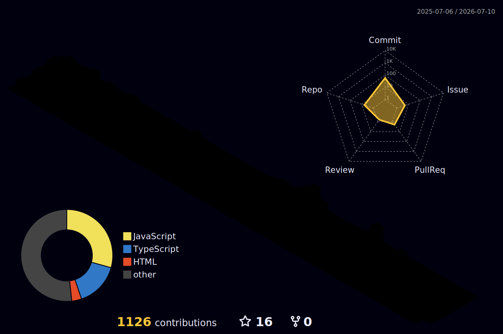

<h1>Hi 👋, I'm Nitin Bharti</h1>

<h3>Software Engineer · Full-Stack Developer · MERN & Next.js Developer</h3>

I create modern, responsive, and scalable web applications with clean code,
thoughtful interfaces, and practical full-stack architecture.

 

 
 

 

 
 

<h2>👨‍💻 About Me</h2>

I'm a software developer who enjoys transforming ideas into useful digital products.
My work combines reliable functionality, intuitive interfaces, and maintainable code.

🔭 Building <strong>production-ready full-stack applications</strong>

🌱 Exploring <strong>scalable architecture, APIs, databases, and modern frontend patterns</strong>

⚡ Focused on <strong>clean code, responsive design, and practical problem-solving</strong>

 

 

 
 

<h2>🏙️ 3D Contribution City</h2>

A three-dimensional view of my GitHub contribution journey.

<picture>
  <source
    media="(prefers-color-scheme: dark)"
    srcset="./profile-3d-contrib/profile-night-rainbow.svg"
  />
  <source
    media="(prefers-color-scheme: light)"
    srcset="./profile-3d-contrib/profile-season-animate.svg"
  />
  
</picture>

 
 

<h2>📊 Engineering Metrics</h2>

A live overview of my languages, coding habits, repositories, and recent GitHub activity.

<picture>
  
</picture>

 
 

<h2>🐍 Contribution Journey</h2>

An animated view of my consistency and growth on GitHub.

<picture>
  <source
    media="(prefers-color-scheme: dark)"
    srcset="https://raw.githubusercontent.com/NitinBharti007/NitinBharti007/output/github-contribution-grid-snake-dark.svg"
  />
  <source
    media="(prefers-color-scheme: light)"
    srcset="https://raw.githubusercontent.com/NitinBharti007/NitinBharti007/output/github-contribution-grid-snake.svg"
  />
  
</picture>

 
 

<h2>🤝 Let's Connect</h2>

I'm always open to discussing software engineering, interesting projects,
collaboration opportunities, and new ideas.

 
 

<h2>Thanks for visiting my profile 😊</h2>

<strong>Let's connect, collaborate, and build something meaningful.</strong>

